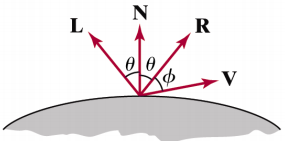
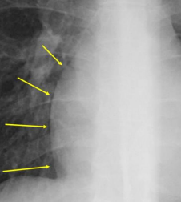

# Illumination and Shading

[toc]

## 3D Rendering Pipeline

## Shading

- Given ：

  scene specification (object positions, optical properties of the surface, viewer position, viewing direction, ......) 

- Find :

  intensity for each pixel

## Illumination Models

- Rendering need a model for how light interacts with objects.
- Physically correct model:
  - the intensity reflected from every point depends on the intensity from every other points
  - **global illumination**
- Simplistic mode:
  - the intensity depends only on the direct illumination due to light sources
  - **local illumination**

## Reflection Models

- **Reflection Models**
  - Describe the way incident light reflects from a surface
  - Ambient, diffuse, specular reflection
  - This model is known as
    - a shading model
    - a lighting model
    - a light reflection model
    - a local illumination model
    - a reflectance model

## Light Intensity Function

$I = K_AI_{AL}+K_D(N \cdot L)I_L+K_s(V \cdot R)^nI_L$

- $I_E$ : emitted intensity for light sources
- $K_A,K_D,K_s$ : **ambient / diffuse / specular** coefficient
- $I_{AL}$ : ambient light intensity
- $N$ : unit normal vector
- $L$ : unit direction vector to the point light source from a position on the surface
- $I_L$ : the intensity of the point light source
- $V$ : unit viewing direction vector
- $R$ : specular reflection vector

## Ambient Light

- multiple reflection of nearby objects (light-reflecting sources) yields a uniform illumination
- ambient illumination is constant for an object, without regard to directions of faces

>$$
>I = K_\alpha I_\alpha
>$$
>
>$$
><Empty \space Math \space Block>
>$$
>
>- $I_\alpha$ : the incident ambient intensity
>
>- $K_a$ : ambient reflection coefficient, the proportion reflected away from surface

### Ambient Light Example

- After applying ambient light

- Independent on the light position, polygon position, viewing condition, or anything else.

- Therefore, it is difficult to allow 3-dimensional effect.

## Diffuse Reflection

- matte (dull) surfaces diffuse incident light uniformly to every direction (light intensity is independent of angle of reflection)
- light intensity depends on angle of incidence

## Specular Reflection

- perfect reflector reflects all lights to the direction where angle of reflection is identical to the angle of incidence. It accounts for the **highlight**
- real object reflects most of light over a range of position close to the direction

- Phong illumination model

  note that N,L and R are coplanar, but V may not be coplanar to otehrs

- For a perfect mirror reflector
  $$
  I = I_L \quad if \quad V = R\\
  	
  	0 \quad otherwise
  $$

- For a near-perfect reflector, the highlight falls off quickly with increasing $\alpha$

  >$I = I_pK_scons^n_\alpha=I_pK_s(R \cdot V)^n$ 
  >$I_p : the \quad intensity \quad of \quad the \quad incident \quad light$
  >$K_s : the \quad color-independ \quad specular \quad cofficient$
  >$n : a \quad term \quad that \quad determines \quad the \quad gloss \quad of \quad the \quad surface \quad (larget \quad value \quad gives \quad small \quad hightlight)$

  

  

## Shading Models

### Constant Shading(Flat Shading)

- infinitely distant light source (constant N  L) result in constant
  diffuse reflection
- constant $N \cdot L$ and infinitely distant viewpoint (constant $N \cdot L$) result in constant specular reflection
- abrupt change in surface orientation of adjacent surfaces produce an unrealistic effect

- Another problem → Mach Band Effect

### Gouraud Shading

- bi-linear shading

- Intensity-interpolation Shading

  1. intensities are calculated only at vertices using averaged normal vector of adjacent surfaces

     

     

  2. intensities for other points are interpolated from the values at vertices

     - Predominant technique in today's workstations with "3D rendering" hardware
     - Deficiency - abnormal highlights, Unrepresentative vertex normals

### Phong Shading

- normal vector interpolation shading

1.  vertex normal vector is calculated as in Gouraud shading
2.  surface normals are interpolated
3.  shades are computed at each point using the interpolated normal vector
   - cons : calculation at every point

- Example

  

- Problems with interpolated shading
  - Perspective distortion
  - Orientation dependence 
  - Shared edges
  - Unrepresentative vertex normals

- Shading Algorithm Results

## Refractions

Refractions (Transparent Surfaces)

- Diffuse Refraction:
  - partially transparent object (e.g. frosted glass) penetrating light is diffused
  - decrease light intensity, spread intensity contribution of each point onto a finite area on the refracting surface
  - expensive, seldom used

- Specular Refraction

$\eta_I$, $\eta_r$ : index of refraction of each material (averaged over wavelengths)

## Transparency

## Recursive Ray Tracing

- the way light actually behaves.

- rendering reflective and transparent objects, shadows and a variety of other subtle effects. 

- Global illumination model

- usually used when we need high image quality and realism

- almost all commercial ray tracers are strictly software (still evolving method)

- Detect visible object by tracing virtual ray

- algorithm
  - determine specular intensities at only visible surface portions eye
  - starting from viewpoint, trace the ray passing through the center of each pixel back to the light source
  - at each reflecting surface, direction of trace is changed
  - at each transparent surface, the ray is divided into two components (i.e. reflection and refraction)

- Pros.
  - very high quality images
  - fast for very complex scenes 

- Cons.
  - slow
  - complexity hinders hardware implementation

## Dithering

1. adding dither noise ===> break up the contours of objects
2. a variant of halftoning method 

- use dither matrix to determine whether or not a pixel is to be turned on

