# Visible Surface Determination

[toc]

## Motivation

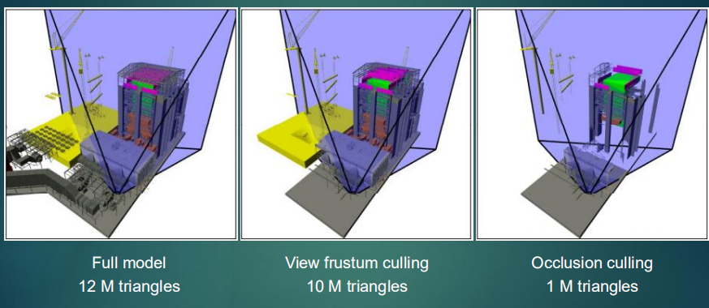

- Surfaces may be **back-facing**

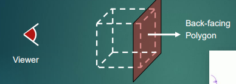

- Surfaces may be **occluded**

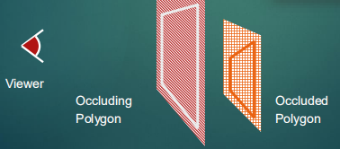

- Surfaces may be **overlapping**

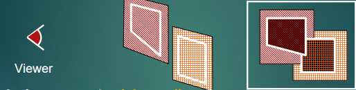

- Surfaces may be **intersecting**

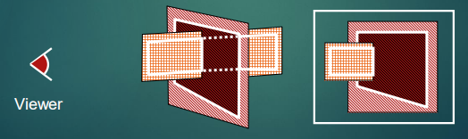

## Hidden Surface Removal

- Hidden surface removal
  - **removal of hidden parts of picture definition**
  - **hidden-surface removal : surface rendering**
  - **hidden-line removal : line drawing**

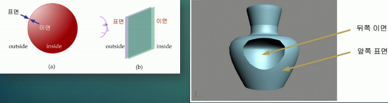

- Affecting factors for the selection of algorithms

  - **memory and processing time requirement**

  - **types of objects**

  - **modeling techniques**

  - **complexity of the scene**

  - **whether the picture is animated**

## Classification of Algorithms

### Classification I

- **object-space method**

  - deals with object definitions

  - compares (parts of) objects with each other

- **image-space method**

  - deals with projection of object definition

  - visibility is decided pixel by pixel

    (usually at the resolution of the display device)

### Classification II

- **point-sampling algorithms**
  - Z-buffer algorithms
  - ray-tracing algorithms
  - painter's algorithms
  - scan-line algorithms

- **continuous algorithm**
  - area/volume subdivision algorithms

## Efficiency Consideration

- Techniques for Efficient Algorithms

  - **visible-surface algorithms are 3D extension of sorting algorithm**
    - depth comparison
  - **avoid comparing all pairs of objects using ...** 
    - Coherence
    - Bounding Volume (extent)
  - Back-face culling

- Coherence

  - **object coherence**: 

    no comparison between components of objects if objects are entirely separated each other

  - **face coherence**:

    surface properties vary smoothly across a face

  - **edge coherence**:
    - an edge may change its visibility not frequently
    - = an edge may change its visibility where it crosses behind a visible edge or penetrates a visible face
  - **implied edge coherence**:
    
    - If one planar face penetrates another, their lines of intersection (implied edge) can be determined from two intersection points
  - **scan-line coherence**:
    
    - little change in visible spans from one scanline to another
  - **area coherence**:
    
    - a group of pixels is often covered by the same visible surface
  - **depth coherence**:
    
    - adjacent parts of the same surface are typically close in depth
  - **frame coherence**:
    
    - animation frames contain small changes from the previous frame

## The perspective Transformation

- The Perspective Transformation
  -  **maps the viewing pyramid to the normalized view volume**

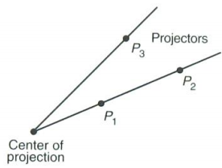

## Extents and bounding volumes

- **Approximate objects with simple enclosures before making comparisons**

- **The simplest approximate enclosure is a boundary box**

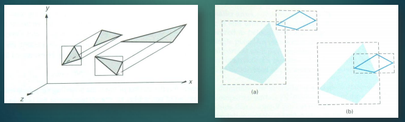

## Rendering Pipeline

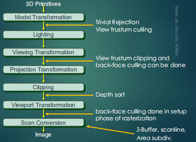

## Backface Removal

- Backface Removal (Backface Culling)

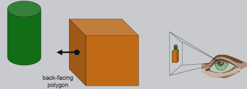

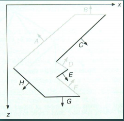

- Definition

  **: removes entire polygons that face away from the viewer**

  **: if we are dealing with a single convex object, culling completely solves the hidden surface problem**

- Geometric test for the visibility

  - **$N_p$ : outward surface normal of a face** 

  - **$V$ : the line-of-sight vector from the polygon to view point → visibility := $N_p \cdot V > 0$**

  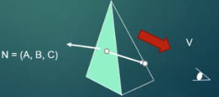

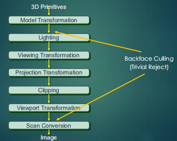

- Backface Removal (Further considerations)

  **: vertex order in surface normal calculation**

  - counterclockwise in right-handed viewing system 

  **: backface culling after viewing transformation**

  - simpler culling test (consider only z component of normal vectors since COP is at infinity after view-volume normalization)

  - more points to transform

  **: not used in ray-tracing, radiosity**

## Advanced Configuration

- In the case of **concave polyhedron**
  - Need more tests
    - Determine faces totally or partly obscured by other faces
  - In general, back-face removal can be expected to eliminate *about half of the surfaces* from further visibility tests

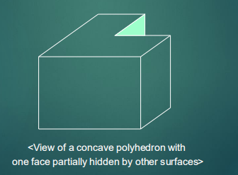

## **Depth-Buffer Algorithm**

- Depth-Buffer Method(Z-Buffer Method)
  - image space algorithm
  - input - objects after mapping to normalized view volume 
  - use of two buffers
    1. refresh buffer : image value (color or intensity)
    2. depth buffer (z-buffer) : z-value

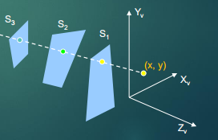

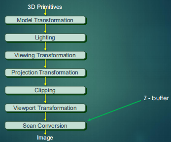

- Initialize the depth buffer and refresh buffer

> depth(x, y) = 0,  
>
> refresh(x, y) = $I_{backgnd}$

- For each position on each polygon surface
  - Calculate the depth for each (x, y) position on the polygon
  - If z > depth(x, y), then set depth(x, y) = z,  refresh(x, y) = $I_{surf}$(x, y)

```C++
Initialize Frame Buffer with Background Color; 
Initialize Z Buffer with Infinite Distance;

for Each Polygon { 
	for Each Pixel { 
		Calculate z of Intersection
		if (Calculated z < Current z of Z-Buffer) {
			Update Z-Buffer with Calculate z;
			Update Frame Buffer with the Color of Current Polygon;
		} 
	} 
}
```


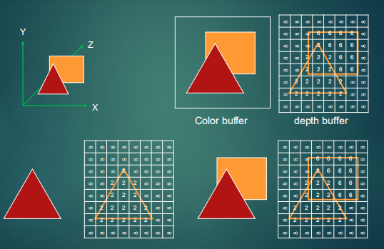

- Pros. and cons.

  - *pros:*

    - easy implementation (directly in hardware)

    - no sorting of surfaces

    - O(# of objects pixels)

    - good rendering algorithm with polygon models

  - *cons:*

    - additional buffer (z-buffer)
    - aliasing (point-sampling)
    - difficult to deal with transparent object 

## **A-Buffer Algorithm**

### Characteristics

- An extension of the ideas in the depth-buffer method
- The origin of this name
  - At the other end of the alphabet from “z-buffer”
  - Antialiased, area-averaged, accumulation-buffer
  - Surface-rendering system developed by ‘Lucasfilm’
  - REYES(Renders Everything You Ever Saw)
- A drawback of the depth-buffer method
  - Deals only with opaque surfaces
  - Can’t accumulate intensity values
  - for more than one surface

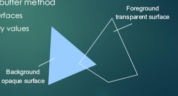

### Algorithm

- Each position in the buffer can reference a linked list of surfaces
  - Several intensities can be considered at each pixel position
  - Object edges can be antialiased

- Each position in the A-buffer has two fields
  - Depth field
    - Stores a positive or negative real number
  - Intensity field
    - Stores surface-intensity information or a pointer value

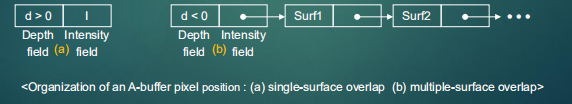

- If the depth field is positive

  - The number at that position is the depth
  - The intensity field stores the RGB

- If the depth field is negative

  - Multiple-surface contributions to the pixel

  - The intensity field stores a pointer to a linked list of surfaces

  - Data for each surface in the linked 

    

◆ RGB intensity components

◆ Opacity parameters(percent of transparency)

◆ Depth

◆ Percent of area coverage

◆ Surface identifier

◆ Pointers to next surface


## **Scanline Algorithm**

- For each scan line
  - Construct intersection edge table
  - Sort by depth

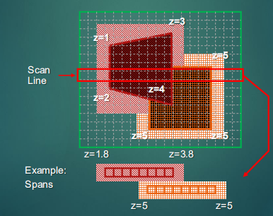

### Example

- Active list for scan line 1

  - Edge table

    - AB, BC, EH, and FG

    - Between AB and BC, only the flag for surface S1 is on

      - No depth calculations are necessary

      - Intensity for surface S1 is entered into the refresh buffer

  - Similarly, between EH and FG, only the flag for S2 is on

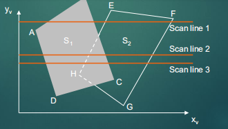

- For scan line 2, 3
  -  AD, EH, BC, and FG
    - Between AD and EH, only the flag for S1 is on
    - Between EH and BC, the flags for both surfaces are on
      - Depth calculation is needed
      - Intensities for S1 are loaded into the refresh buffer until BC
  - Take advantage of coherence
    - Pass from one scan line to next
    - Scan line 3 has the same active list as scan line 2
    - Unnecessary to make depth calculations between EH and BC

###  Drawback

- Only if surfaces don’t cut through or otherwise cyclically overlap each other
  - If any kind of cyclic overlap is present
  - Divide the surfaces

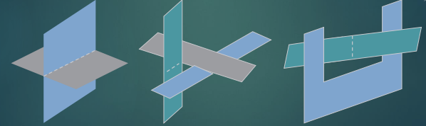

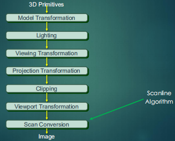

## **Depth-Sort Algorithm**

### List-Priority Algorithms

- If we scan convert all the polygons with more distant polygons first and closer polygons later, the closer ones will hide the more distant ones.
  - **sort all the polygons and then scan convert**
- not good for complex scenes
- limited parallel operations

- Painter’s Algorithm

  - It is necessary for “depth sort”.

  - Sorting objects according to $Z_{max}$

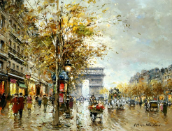

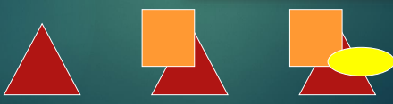

### Algorithm

- Referred to as the **painter’s algorithm**
  - In creating an oil painting
    - First paints the background colors
    - The most distant objects are added
    - Then the nearer objects, and so forth
    - Finally, the foregrounds are painted over all objects

- Each layer of paint covers up the previous layer

- Process
  - **Sort surfaces** according to their distance from the view plane
  - The **intensities for the farthest surface** are then entered into the refresh buffer
  - Taking each succeeding surface in decreasing depth order

  -> Z-buffer algorithm

  - No depth comparison between objects, only use depth value on pixel

## Overlapping Tests

- Tests for each surface that overlaps with S

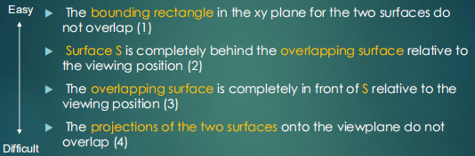

- If all the surfaces pass at least one of the tests, none of them is behind S
  - No reordering is then necessary and S is scan converted

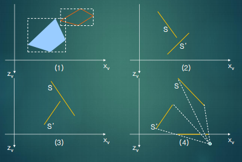

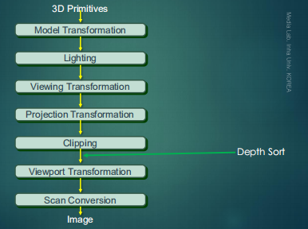

## Ray-casting method

- Cast ray from viewpoint through each pixel
  - To find front-most surface

- Comments
  - O(pixels)
  - Conceptually simple, but not generally used

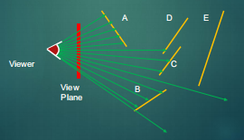

### Characteristics

- Based on geometric **optics methods**
  - Trace the paths of light rays
  - Line of sight from a pixel position on the view plane through a scene
  - Determine which objects intersect this line
  - Identify the visible surface whose intersection point is closest to the pixel
- Infinite number of light rays
  - **Consider only** rays that pass through **pixel positions**
    - Trace the light-ray paths backward from the pixels
- Effective visibility-detection method
  - For scenes with curved surfaces

## **Spatial Partitioning**

- Spatial Partitioning(=Spatial subdivision)
  - use **spatial coherence**
  - partitioning in 3D object space or in the image space
  - use quadtree, octree, BSP-tree

- Takes advantage of area coherence

- Locating view areas that represent part of a single surface
  - Successively dividing the total viewing area into smaller rectangles
  - **Until each small area** is the projection of part **of a single visible surface** or **no surface**
  - Require tests
    - **Identify the area** as part of a **single surface**
    - Tell us that the area is too complex to analyze easily

  

## **BSP-tree**

###　Binary space-partitioning

- the scan conversion order is decided by building a binary tree of polygons

- the **BSP tree**

- fast traversal and viewpoint independent order

- clusters that are on the same side of the plane as the eye－point can obscure clusters on　the other side. 

- intersection and sorting at object precision

- more polygon splitting may occur than in Painter's algorithm

- Identifying surfaces
  - “inside” and “outside” the partitioning plane

- Intersected object
  - Divide the object into two separate objects(A, B)

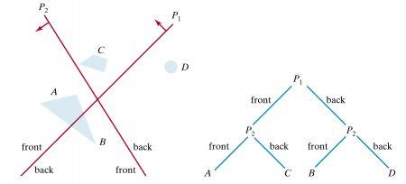

## **Quad-tree**

### Process

- Staring with the total view
  - Apply the identifying tests
  - If the tests indicate that the view is sufficiently complex
    - Subdivide
  - Apply the tests to each of the smaller areas
    - Until belonging to a single surface
    - Until the size of a single pixel

- Example
  - With a resolution $1024\times  1024$
  - 10 times before reduced to a point

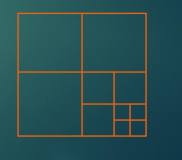

## Identifying Tests

- Four possible relationships
  - Surrounding surface
    - Completely enclose the area
  
  - Overlapping surface
    - Partly inside and partly outside the area
  - Inside surface
  
  - Outside surface
  
- **No further subdivisions** are needed if one of the following 

  conditions is true
  - **All surface** are **outside** surfaces with respect to the area
  - Only one inside, overlapping, or surrounding surface is in the area

- **A surrounding surface** obscures all other surfaces within the area boundaries → from depth sorting, plane equation

## **Octree Method**

### Characteristics

- Extension of **area-subdivision method**

- **Projecting octree nodes** onto the viewplane
  - Front-to-back order <--> Depth-first traversal
    - The nodes for the front sub-octants of octant 0 are visited before the nodes for the four back sub-octants
    - The pixel in the frame buffer is assigned that color if no values have previously been stored
      - Only the front colors are loaded

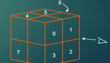

### Displaying An Octree

- Map the octree onto a quadtree of visible areas

- Traversing octree nodes from front to back in a recursive procedure

- The quadtree representation for the visible surfaces is loaded into the framebuffer

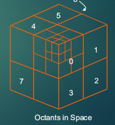

## **Wireframe Method**

### Wireframe Visibility Methods

- **Compare** each **line** to each surface
  - Direct approach to identifying the visible lines
  - Depth values are compared to the surfaces
  - Use coherence methods
    - No actual testing each coordinate
- With depth-sorting
  - Interiors are in the background color
  - Boundaries are in the foreground color
  - Processing the surfaces from back to front
    - Hidden lines are erased by the nearer surfaces

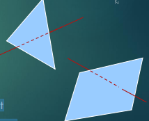

## **Summary**

### Comparison

- Back-face detection methods
  -  **Fast and effective** as an initial screening
    - Eliminate many polygons from further visibility tests
  - In general, this **can’t completely identify all hidden surfaces**

- Depth-buffer(z-buffer) method
  - **Fast and simple**
  - Two buffers
    - Refresh buffer for the pixel intensities
    - Depth buffer for the depth of the visible surface

- A-buffer method
  - An improvement on the depth-buffer approach
  - **Additional information**
    - **Antialiased and transparent** surfaces
  - Other visible-surface detection schemes
    - Scan-line method
    - Depth-sorting method(painter’s algorithm)
    - BSP-tree method
    - Area subdivision method
    - Octree methods
    - Ray casting

### Rendering Pipeline

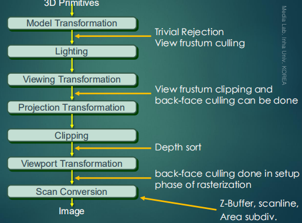